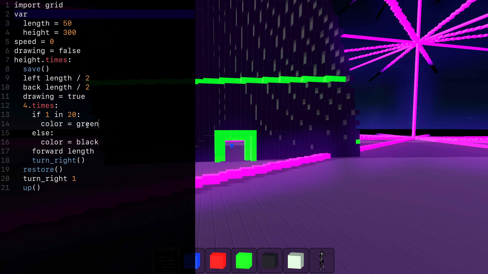
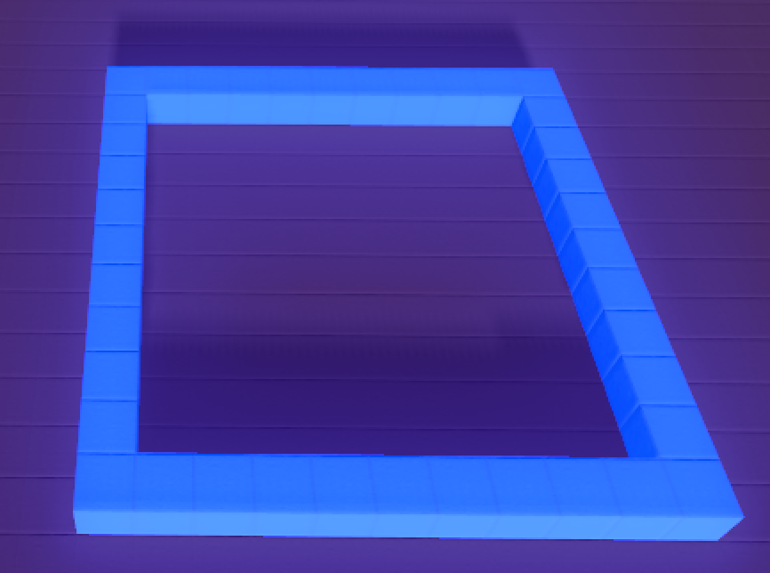
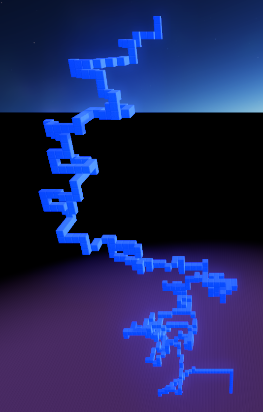
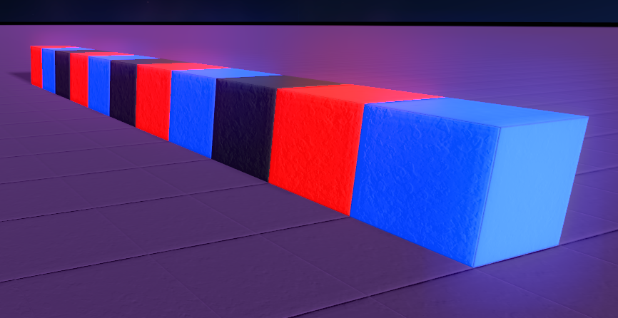

# Enu
3D live coding, implemented in Nim.



Enu lets you build and explore worlds using a familiar block-building interface and a Logo inspired API.
It aspires to make 3D development more accessible, and will eventually be usable to create sandalone games.

Enu isn't ready for public testing, but it's getting close. MacOS, PC and Linux version of Enu 0.1 should be ready on Friday, Nov. 6th 2020.

# Demo
See the [Enu 0.1 demo video](https://youtu.be/upg77dMBGDE):

[](https://youtu.be/upg77dMBGDE)

### Outdated Demos

- [Enu 0.01 Intro and Demo](https://youtu.be/QfAzuX7-y0Y)
- [Introducing Enu - NimConf 2020](https://youtu.be/3l6tsKM1cY8)
# Examples

Draw a square:
```nim
forward 10
right 10
back 10
left 10
```
or:
```nim
4.times:
  forward 10
  turn_right()
```

Create a twisting tower:
```nim
var
  length = 20
  height = 50

height.times:
  left length / 2
  back length / 2
  4.times:
    forward length
    turn_right()
  forward length / 2
  right length / 2
  turn_right 5
  up()
```


Draw randomly:
```nim
up 10
forward 10
(50..100).times:
  forward 2..5
  turn_right -180..180
  up 0..2
```


Set the color to blue randomly with a 1 in 50 chance. Otherwise set it to white:
```nim
if 1 in 50:
  color = blue
else:
  color = white
```
or as a one-liner:
```nim
color = if 1 in 50: blue else: white
```


Move forward 10 times, cycling through colors:
```nim
for i in 0..9:
  next_color()
  forward()
```
or:
```nim
10.times:
  color = cycle(red, black, blue)
  forward()
```


# Install

```console
$ nimble prereqs
$ nimble build
$ nimble start
```

### Notes

Enu temporarily requires a custom Godot version, which lives in `vendor/godot`. This is
built as part of `nimble prereqs`.

See https://docs.godotengine.org/en/3.2/development/compiling/index.html

Windows and Linux targets aren't well tested currently, and may not work.

# Usage

Move with WASD keys. Double jump to toggle flying. Space and shift to go up
and down while flying. Ctrl/Cmd+P to pause all scripts. Ctrl/Cmd+F to toggle
fullscreen. ESC to grab/release mouse, and close editors.

Ctrl/Cmd+Q to quit. Number keys to switch modes:

- 1. Code Mode. Select objects to modify their code. Ctrl/Cmd+S to save.
- 2-6. Build Mode. Shape the world with by painting voxels, or using the Minecraft inspired interface.
- 7. Object Mode. Place and destroy pre-built objects.

Enu 0.1 will only feature 5 block types/colors, and 1 object model (a robot). This will be greatly
expanded in the future.

# Tasks

### v0.01

- [X] Simplify box object for performance
- [X] Add keybindings to README
- [X] Rework "deselect" behavior
- [X] Ability to place objects
- [X] Basic error handling

### v0.02

- [X] Better syntax highlighting (comment support at least)
- [X] Make object pick raycast longer
- [X] Mouse picking
- [X] Better flying
- [X] More block types
- [ ] Validate build and keybindings for Mac/Linux/Windows
- [X] Support non-hidpi screens
- [X] Use Inconsolata on Windows/Linux

### v0.1

- [ ] `enu init` command (or similar) for creating a new project
- [ ] Demo game
- [ ] Script improvements required to support demo
- [ ] Basic 1 page in-game help document
- [ ] Mac/Windows/Linux binaries

### v0.2

- [ ] Upstream Nim changes
- [ ] 2nd demo game
- [X] Basic UI
- [ ] Controller support
- [ ] iPad release

# Changelog

- HiDPI support. Fonts should look like a proper native app.
- Switched font to SF Mono. Non-Apple platforms will use Inconsolata or similar in the future.
- Fixed input handling. Console now scrolls properly, and events should only be consumed in one place.
- Render resolution can be scaled for performance. Set stretch_shrink on the ViewContainer.
- Objects should highlight more or less properly.
- Better error handling.
- Highlight errors in editor.
- Build tweaks.
- Switched to Nim devel 1.3
- Use [Nim VM execution hooks](https://github.com/nim-lang/RFCs/issues/249).
- The currently executing line is highlighted if the editor is open.
- Added `nimble start` command to launch directly into Enu.
- Scripts no longer require a `main:` section.
- Flying is better, I think.
- Much faster script reloading
- `grid.speed` now represents dropped blocks per second.
- `grid.speed = 0` now works properly, running the entire script in a single frame
- `grid.drawing = false` enables moving the pen without dropping blocks.
- `grid.save()` and `grid.restore()` to save/restore position/direction/index/speed/drawing
  state while drawing blocks. Pass a `name` argument to support multiple save points.
- Fixed build/run on Linux. Input is still broken.
- Added a dock for actions, objects and block types. Statically populated for now.
- Console can be toggled with ` or ~, or cleared with Cmd+K.
- Added a preview generator, for taking images of blocks and objects for placement on the
  dock. Must be manually configured per object for now. This will be automatic in the future.
- Now uses https://github.com/Zylann/godot_voxel for static voxels. Much better performance.
  Scaled or moving objects will use the old gridmap approach for now.
- Voxel painting support. Press ESC to toggle mouse capture. If the mouse is uncaptured, the
  cursor can be used to paint or select.
- Added a "Builder" object that can create objects based on gridmaps, or voxel terrains.
  Builders are automatically created when you start constructing a new object 2+ blocks from
  an existing object. Each builder can be scripted. Builders are NOT currently removed when
  their voxels are destroyed, but they will be in the future. Delete builders (and everything
  else) with `nimble reset`.
- Drawing outside the visible area now works properly.
- Better voxel highlighting. Each object gets its own materials.
- Deleting the last block in an object deletes the builder.
- "Hole" support. If you delete blocks from a scripted build, they'll stay
  deleted during future runs. Fill them in with their proper blocks (or set
  `overwrite = true` in your script) and the hole will be forgotten on the next
  run.
- CC0 space skybox from
  https://www.reddit.com/r/blender/comments/3ebzwz/free_space_hdrs_1/
- Added fog and a shader based distance fade
- Added black and white blocks.
- Turtle icon from
  https://www.pexels.com/photo/close-up-photo-of-turtle-2613148/
- Added `ē` icon and splash screen.
- Move support. Voxel objects can be moved rather than built from inside a
  `move:` block.
- Allow tweaking color energy inside scripts.
- Editor quality of life improvements. Better auto indent, and proper HOME/END support.
- Fixed lots of 3d issues to properly support rotation and scaling.
- Anything expecting a float or an int can be passed a slice (`1..100`) to use a random
  value in the specified range.
- Cycle through different options using the `cycle` template.
