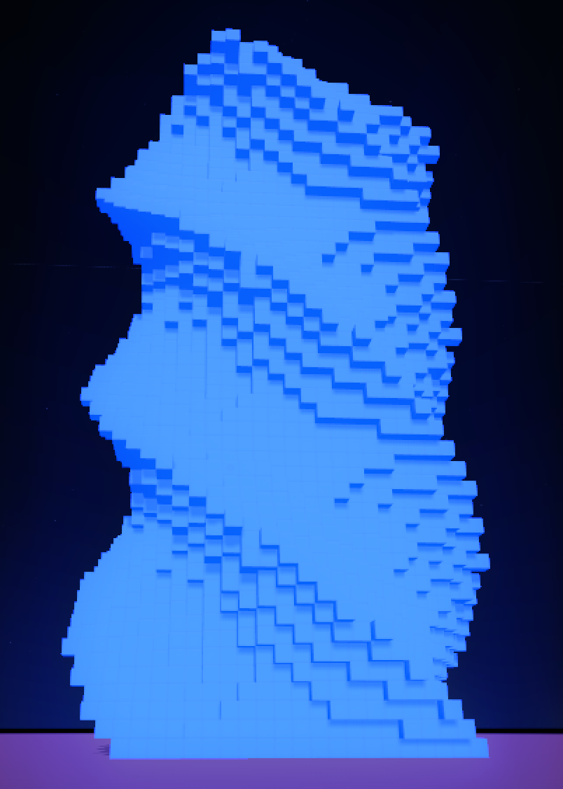

*Note: This is the development branch of Enu 0.2, and is currently unstable and undocumented. It has only been tested on macos,
and may not build on other platforms. The stable branch is in better shape.*

# Enu

3D live coding, implemented in Nim.


Enu lets you build and explore worlds using a familiar block-building interface and a Logo inspired API.
It aspires to make 3D development more accessible, and will eventually be usable to create standalone games.

# Install

Download from https://github.com/dsrw/enu/releases. The Windows version isn't signed, and
UAC will warn that it's untrusted. This will be fixed in a future release.

The Linux version hasn't been tested particularly well, but it works for me under Ubuntu 20.04. Please report any issues.

The world format will change in a future release. Worlds created in 0.1 won't be supported in future versions.

# Demo

See the [Enu 0.1 demo video](https://youtu.be/upg77dMBGDE):

[](https://youtu.be/upg77dMBGDE)

### Outdated Demos

- [Enu 0.01 Intro and Demo](https://youtu.be/AW0PT9j976s)
- [Introducing Enu - NimConf 2020](https://youtu.be/3l6tsKM1cY8)

# Examples

Draw a square:
```nim
forward 10
right 10
back 10
left 10
```
or:
```nim
4.times:
  forward 10
  turn_right()
```

Create a twisting tower:
```nim
var
  length = 20
  height = 50

height.times:
  left length / 2
  back length / 2
  4.times:
    forward length
    turn_right()
  forward length / 2
  right length / 2
  turn_right 5
  up()
```


Draw randomly:
```nim
up 10
forward 10
(50..100).times:
  forward 2..5
  turn_right -180..180
  up 0..2
```


Set the color to blue randomly with a 1 in 50 chance. Otherwise set it to white:
```nim
if 1 in 50:
  color = blue
else:
  color = white
```
or as a one-liner:
```nim
color = if 1 in 50: blue else: white
```


Move forward 10 times, cycling through colors:
```nim
for i in 0..9:
  next_color()
  forward()
```
or:
```nim
10.times:
  color = cycle(red, black, blue)
  forward()
```


# Build and Run

```console
$ nimble prereqs
$ nimble build
$ nimble import_assets
$ nimble start
```

## Notes

Enu requires a custom Godot version, which lives in `vendor/godot`. This will be fetched
and built as part of `nimble prereqs`.

See https://docs.godotengine.org/en/3.2/development/compiling/index.html

# Usage

## Keyboard/Mouse

- `ESC` - toggle mouse capture and to dismiss editor windows. Reloads script changes.
- `W, A, S, D` - move around when mouse is captured.
- `Space` - jump. Double jump to toggle flying. Hold to go up while flying.
- `Shift` - run.
- `C` - go down while flying.
- `~` - toggle the console.
- `F` - toggle fullscreen.
- `1` - enter edit mode.
- `2 - 9` - change active action.
- `Mouse Wheel Up/Down` - change active action.
- `Ctrl` - reload script changes. Hold to temporarily capture the mouse and move, so you can
  change your view without having to switch away from what you're doing.
- `Cmd+P / Ctrl+P` - Pause the current script.
- `Left Click` - Place a block/object or open the code for the currently selected object.
- `Right Click` - Remove a block/object.

## XBox / Playstation Controller

- `Left Stick` - move.
- `Right Stick` - change view.
- `A / X` - jump. Double jump to toggle flying. Hold to go up while flying.
- `B / ◯` - go down while flying. Dismiss code editor.
- `Y / △` - toggle edit mode.
- `L1 / R1` - change active action.
- `L2` - place a block/object or open the code for the currently selected object.
- `R2` - remove a block/object.
- `L3` - run.

Enu currently includes 5 block types/colors, and 1 object model (a robot). This will be greatly
expanded in the future.

## Building

Drop a block or robot with the left mouse button/controller trigger, remove it with the right. Adjoining blocks will be combined into a single structure. With the mouse captured, building works more or less like MineCraft. Release the mouse by pressing ESC to draw blocks using the mouse cursor.

Code by switching to the code tool by left clicking/triggering on an object or structure. Changes are applied when the code window is closed (ESC key) or CTRL is pressed. Holding CTRL will also temprarly grab the mouse and allow you to change your position.

# Config

The Enu data directory lives in `~/Library/Application Support/enu` on Mac, `%AppData%\enu` on Windows, and `~/.local/share/enu` on Linux. `config.json` has a few configurable options:

`downscale`: Increase to render at a lower resolution to improve performance. Should be an integer.

`font_size`: The font size. DPI is currently ignored, so hidpi screens will require a higher number.

`dock_icon_size`: Size of the icons in the dock. DPI is currently ignored, so hidpi screens will require a higher number.

`world`: The world/project to load. Change this to create a new world.

`show_stats`: Show FPS and other stats.

# Tasks

### v0.2

- [ ] Slim down Godot classes. Move out most of the state.
- [ ] General refactoring and cleanups.
- [X] Rethink Nim VM usage. Ideally, everything will run in a single VM.
- [ ] State machines to manage UI and player behavior.

### v0.2.1

- [ ] iOS support.
